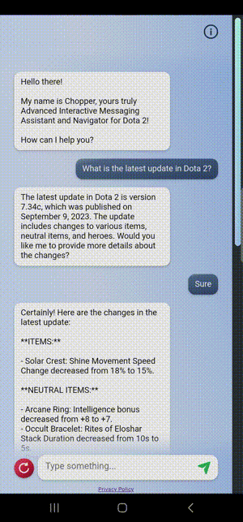

![Preview Mode][mode-preview]

# OpenAI Knowledge-Base Integration

![OpenAI-KB Logo][main-logo]

<strong><i>Let's impart some new specific knowledge to our good old OpenAI friend!</i></strong>

---

  ![Node.Js Version][version-nodejs]
  ![npm Version][version-npm]
  ![Vue.js Version][version-vuejs]

  ![Windows Version][version-windows]
  ![WSL2 Version][version-wsl2]

  ![CPU Version][version-cpu]
  ![GPU Version][version-gpu]

---

  [![MIT License][license-mit]][license-mit-url]

---

This project showcases a groundbreaking Proof-of-Concept (POC) product, illustrating the seamless integration of OpenAI and a targeted knowledge-base.

**Chopper**, the _OpenAI-driven_ Chatbot, leverages on the powerful _GPT-3.5 Turbo model_ to assist users with the latest information and updates about the online multiplayer battle arena game developed by Valve, that is _Dota 2_.  

As a dedicated Dota 2 Assistant, Chopper will operate exclusively within the Dota 2 knowledge-base, restricting its conversations and context to the specific domain.

---

## Motivation :pushpin:
The OpenAI GPT models stand as remarkable creations, aiding users in navigating vast amounts of data. However, it is crucial to note that _GPT-3.5_ models was trained only on data up until _September 2021_, missing any information after that date.

To address this limitation, the concept of the _Knowledge-Base_ was introduced. It enables the model to learn new data and information using the innovative _One-Shot Learning_ approach.

The primary goals of this project are to:
1) Introduce new and specific knowledge to the GPT model.
1) Confine conversation contexts within the domain of the knowledge base.

---

## Side-by-Side Comparison :pushpin:
<table>
    <tr>
        <th>Base Model App</th>
        <th>With Knowledge-Base Integration</th>
    </tr>
    <tr>
        <td>
            
        </td>
        <td>
            
        </td>
    </tr>
    <tr>
        <td>
            It works like a normal ChatGPT, trying to have a conversation about anything.
            <ul>
                <li>Equipped with data and information up until August 2021.</li>
                <li>It engaged in discussions on a wide variety of topics provided by the user.</li>
            </ul>
        </td>
        <td>
            It operates within defined parameters when responding to the user.
            <ul>
                <li>Equipped with data and information up until August 2021 <i>and</i> <u>is capable of engaging in discussions exclusively on topics within the established knowledge domain.</u></li>
                <li>Efforts were made to <u>steer conversations back to the designated knowledge-base domain</u> when necessary.</li>
            </ul>
        </td>
    </tr>
</table>

---

## User Interface (UI) Elements Showcase :pushpin:
<table>
    <tr>
        <th>Element</th>
        <th>Landscape</th>
        <th>Portrait</th>
        <th>Remarks</th>
    </tr>
    <tr>
        <td>
            Info Button
        </td>
        <td>
            
        </td>
        <td>
            
        </td>
        <td>
            The "About" modal appears, displaying the development motivation.
        </td>
    </tr>
    <tr>
        <td>
            Clear Button
        </td>
        <td>
            
        </td>
        <td>
            
        </td>
        <td>
            The "Clear Conversation" modal appears, requesting confirmation from the user.
        </td>
    </tr>
    <tr>
        <td>
            Scrolling
        </td>
        <td>
            
        </td>
        <td>
            
        </td>
        <td>
            The conversation messages scroll beneath the fixed feathered header and footer.
        </td>
    </tr>
</table>

<!-- --- -->

<!-- ## License :pushpin:
This project is licensed under MIT License. 
 
You are welcome to use this code for anything you want. Feel free to modify, share, and distribute it. However, please be aware that there is no warranty and we are not responsible for any issues that might occur. 
 
If you use this code, a little shout-out attribution to me would be great. Happy coding! :tada: -->

<!-- REFERENCES -->
<!-- MODE -->
[mode-preview]: https://img.shields.io/badge/Mode-Preview-ff8700

<!-- README LOGO -->
[main-logo]: ./README_Data/OpenAI-KB_Logo.png

<!-- SPECIFICATIONS -->
[version-nodejs]: https://img.shields.io/badge/Node.Js-18.16.1_LTS-026e00?logo=nodedotjs&logoColor=white
[version-npm]: https://img.shields.io/badge/npm-9.5.1-cb0000?logo=npm&logoColor=white
[version-vuejs]: https://img.shields.io/badge/Vue.js-3.3.4-42b883?logo=vuedotjs&logoColor=white
[version-windows]: https://img.shields.io/badge/Windows-11-087cd5?logo=windows11&logoColor=white
[version-wsl2]: https://img.shields.io/badge/WSL_2-Ubuntu_20.04.6_LTS-84215b?logo=ubuntu&logoColor=white
[version-cpu]: https://img.shields.io/badge/CPU-AMD_Ryzen_9_5900X-d10f3d?logo=amd&logoColor=white
[version-gpu]: https://img.shields.io/badge/GPU-Nvidia_RTX_3080-74b71b?logo=nvidia&logoColor=white

<!-- LICENSE -->
[license-mit]: https://img.shields.io/badge/License-MIT-3da638?logo=superuser&logoColor=white
[license-mit-url]: https://github.com/zaimzazali/OpenAI_Knowledge-Base_Preview/blob/main/LICENSE
